```mermaid
graph TD;

    subgraph Scraping the songs lists
        Billboard["🔗 Billboard top 200"]
        scraper["🐍 Custom Python Scraper"]
        Billboard --> scraper
    end

    subgraph Updating the playlists
        songspuller["🐍 Python script for Spotify songs extraction"]
        updater["🐍 Python script for updating the playlists"]
        github["🐈‍⬛ Repo / local"]
        spotify["🎧 Spotify API"]
        telegram["✈️ Telegram API"]

        scraper -->|Top 200 songs list| songspuller
        songspuller -->|Queries for songs| spotify
        spotify -->|Songs data| songspuller
        songspuller -->|Top 200 songs spotify data| updater
        updater -->|Top 200 songs csv| github
        updater -->|Updates the playlists| spotify
        updater -->|Updates logs| telegram
    end
```

```mermaid
graph TD;

    subgraph Playlist Follower Reporting
        reporter["🐍 Python script for creating, saving and sharing the pdf reports"]
        github["🐈‍⬛ Repo / local"]
        spotify["🎧 Spotify API"]
        telegram["✈️ Telegram API"]
        mega["💾 MEGA DB"]

        spotify -->|Playlists data| reporter
        reporter -->|Latest report| github
        reporter -->|Latest report| telegram
        reporter -->|Once a week - Latest report| mega
    end
```

# top-playlist-maker

## 1. Automatically updated spotify playlists

#### ✅ Done

##### **OBJECTIVES**

To create many playlists which can be automatically managed and updated. This saves time because it removes the need for manual songs refreshing, and a playlist with recently added or refreshed songs is more attractive for the followers. There can be many ways of doing it and surely I will do more in the future, but below is an overview of what I have achieved so far.

##### **TOP GLOBAL PLAYLISTS**

They cover the top 200 most popular songs **globally** at the moment, and are updated daily.

-   [DAILY TOP 200](https://open.spotify.com/playlist/4oFMXgSsKQhic55zAHOljt?si=680ff1a98fe342c4&nd=1&dlsi=20a47c1d00994c1f)
-   [DAILY TOP 100](https://open.spotify.com/playlist/21xmtGN7jfS9EsciL63e05?si=bbe18b7574ad4407&nd=1&dlsi=7612eece394748d8)
-   [DAILY TOP 50](https://open.spotify.com/playlist/0jpg9zJAauAVNZB8hL0lRZ?si=32a5df262d6647af&nd=1&dlsi=82fecf5ce7434851)

##### **WORKFLOWS**

🔗[Billboard top 200](https://www.billboard.com/charts/billboard-global-200/)



##### **NEXT STEPS**

The main blocker in this part of the project is to find new reliable and stable sources of data containing fresh, and updated music. There are many more billboard lists, but they are not free. Youtube playlists might be an option, or something totally custom. This topic needs a lot of research.

---

## 2. Playlists followers reports

#### ✅ Done

##### **OBJECTIVES**

This project is set to ingest playlists data from Spotify API, package it into a comprehensive pdf report, and send it to me via Telegram. A report like this is created daily, and the latest is always kept locally in _src/data/reports/_. Every friday, a report is also sent to MEGA file storage in the could, just to have a backup copy.

##### **WORKFLOWS**

🔗[Billboard top 200](https://www.billboard.com/charts/billboard-global-200/)



##### **NEXT STEPS**

In the future the followers data might be kept in a DB instead of locally,
also this project might be responsible for keeping the playlists json and covers folder updated across all the repos.

---

## 3. Link-tree management

#### 🔄 In Progress

##### **OBJECTIVES**

🔗 [Linktree](https://pulsebeatsofficial.click/)
The goal there is to keep a json file containing all playlists data, and make it shared between the workflows for reporting, and the link-tree. I have decided on the structure already:

```
[
    {
        "label": "DAILY TOP 50",
        "description" : "The most popular songs  in the world right now.  Daily updated playlist of 50 most viral songs from today. You can find global trending hits, tiktok songs & more. Follow for latest tracks and new music every day!",
        "image": "daily_top_50.png",
        "url": "https://open.spotify.com/playlist/0jpg9zJAauAVNZB8hL0lRZ",
        "button_id": "daily_top_50"
    },
]
```

With this, two things need to be shared between the two repos to maintain consistency in naming and code:

1. _playlists.json_ (json with playlists data)
2. _covers/ (folder_ with playlists covers)

##### **THE PLAN**

The plan is to extend the functionality of the follower reporting workflow, with updating the json and the covers (if there are new playlists or deleted), and then copy them into the link-tree repo. The link-tree repo is set to deploy with every commit, so right after the commit with new json and covers happens, the page is deployed and the playlists buttons on the webiste are updated.

##### **IDEAS**

It might be useful to set up a sorting algorythm for the playlists, to take into considersation things like playlist popularity, recent growth and music genre of the playlist.

---

## 4. Link-tree traffic analisys and reporting

#### ⏸️ ON HOLD - PowerBI is having problems with data ingestion form Supabase

##### **OBJECTIVES**

The goal is to ingest traffic and behaviour data from GA4, which is integrated with the LINK-TREE for the playlists using BigQuery, and create custom PowerBI reports. The idea came from the fact that GA4 standalone is not intuitive for reporting purposes, can't be as flexible as custom reports, and I don't want to be dependent on the platform. That's why all the event data from GA4 is transfered to BigQuery, and with the use of the official API it can be easily extracted and used. The reason for not querying BigQuery directly is that - first, it only holds data for 60 days, and second, the structure of the data is overwhelming and too complex to query it directly in PowerBI. This issue is resolved by building a ETL pipeline to only extract valuable data in a comprehensive format and keep it in a Postgres DB, here I used free SubaBase service which is simple and scalable.

##### **TECHNICAL PIPELINE / DATA FLOW**

🔗 [Linktree](https://pulsebeatsofficial.click/)



```mermaid
graph TD;

    subgraph Tracking
        LINK-TREE["🔗 Linktree"]
        GA4["📈 Google Analytics 4"]
        LINK-TREE -->|Clickstream events| GA4
    end

    subgraph Analytics Pipeline
        GA4 -->|Export| BigQuery["🗃️ BigQuery"]
        BigQuery -->|Extract & Transform| python["🐍 Python ETL"]
        python -->|Load| supabase["🛢️Supabase (PostgreSQL)"]
    end

    subgraph Reporting
        supabase -->|Query| pbi["📊 Power BI"]
    end

```

##### **REPORT PLAN / VISUALIZATION**

The most important things that need to be included in the report are:

-   DAILY, WEEKLY AND MONTHLY GRANURALITY:
    -   Overall traffic, (bar chart or line chart with last 7 days)
    -   Traffic sources distribution, (a pie chart)
    -   Playlist link button clicks distribution, (horizontal bar chart)
    -   Social link button clicks distribution, (vertival bar chart)
    -   Singular Descriptive values like:
        -   sum(playlist buttons clicks) / traffic -> CTR for playlist buttons
        -   sum(social buttons clicks) / traffic -> CTR for social buttons
        -   avg(timestamp of clicking a button - timestamp of entering the page)

The rest is TDB.

##### **EVENTS CUSTOMIZED FOR REPORTING PURPOSES:**

-   ##### Playlist link button click event:
    -   event_name : 'button_click'
    -   event_category : 'playlist'
    -   event_label : playlist mapping id e.g. top_200_global
-   ##### Social link button click event:
    -   **TBD**

##### **DATA NEEDED FOR THE REPORTS:**

-   Daily playlist button click events,
-   Daily social button click events,
-   Daily amount of users on the website
-   Source of the user traffic, e.g. Organic, Tiktok, Instagram
-   User level data: user time on the website, user id for users comparison, timestamp of clicking a button, timestamp of enterign the website, timestamp of leaving the website

---
